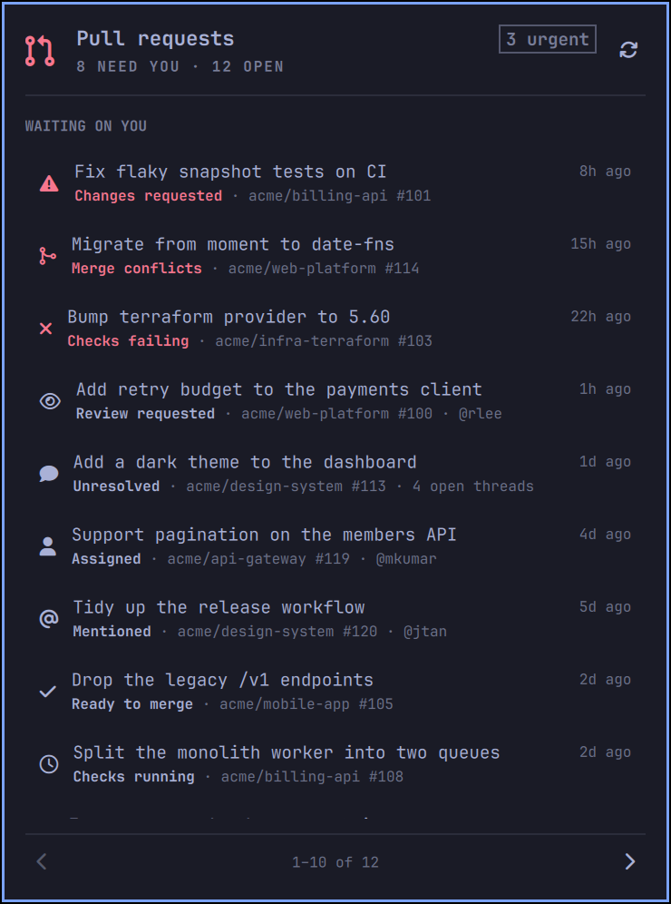

# Pull requests — an Omarchy bar widget

Shows how many GitHub pull requests are waiting on **you**, and lists them ten
at a time. Click a row to open it in your browser.



The bar shows a count in your theme's urgent colour when something needs you,
and dims to a plain icon when nothing does:


---

## Why not just `gh pr status`?

Because "needs me" is not one query. GitHub's `involves:` qualifier does *not*
include review requests, and none of the search qualifiers tell you that your
own pull request is red, conflicted, or sitting on unanswered review threads.

This widget runs four searches in a single GraphQL round trip, merges them, and
gives every pull request the *single most urgent reason* it is on your list.

## What counts as "waiting on you"

| Reason | Counted on the bar | When |
|---|:--:|---|
| Changes requested | ● urgent | your PR, a reviewer asked for changes |
| Merge conflicts | ● urgent | your PR, `mergeable: CONFLICTING` |
| Checks failing | ● urgent | your PR, the check rollup came back `FAILURE`/`ERROR` |
| Review requested | ● | you (or a team you are in) are a requested reviewer |
| Unresolved | ● | your PR has open, non-outdated review threads |
| Assigned | ● | you are the assignee but not a reviewer |
| Mentioned | ● | you were @-mentioned |
| Ready to merge | ● | your PR is approved |
| Checks running | ○ | your PR, checks still pending |
| Awaiting review | ○ | your PR, nobody has looked yet |
| Draft | ○ | your PR is a draft |
| Commented | ○ | you commented; nothing is owed |

The number on the bar is the count of ● rows. The panel always lists
everything, ordered by that table and then by most recently updated, so the
things that are actually blocked sit at the top.

Precedence is strict and first-match-wins, so a pull request that is *both*
conflicted and failing CI reports the conflict — the thing you have to fix
first. Your own pull requests are judged on their state; everyone else's on how
you were pulled in.

## Install

Requires [Omarchy](https://omarchy.org/) 4.x (the Quickshell-based shell),
[`gh`](https://cli.github.com/) authenticated with `gh auth login`, and `jq`.

```bash
omarchy plugin add https://github.com/HaydenKSmith/omarchy-pull-requests.git
omarchy plugin enable hayden.pull-requests
omarchy bar move hayden.pull-requests --section right
```

`omarchy plugin add` clones into `~/.config/omarchy/plugins/hayden.pull-requests/`
and leaves the plugin disabled so you can read the code first — it runs
unsandboxed inside the shell process. Later, `omarchy plugin update
hayden.pull-requests` fast-forwards the checkout.

## Using it

**Bar icon** — left click opens the panel · right click refreshes · middle
click opens <https://github.com/pulls>.

**In the panel** — `↑`/`↓` or `j`/`k` move · `←`/`→` or `h`/`l` change page ·
`Enter` opens the highlighted pull request · `r` refreshes · `g` opens the
GitHub dashboard · `Esc` closes.

Bind a key to summon it directly, in `~/.config/hypr/bindings.lua`:

```lua
o.bind("SUPER CTRL", "P", "omarchy-shell hayden.pull-requests toggle")
```

It also answers IPC, which is handy for scripts and status lines:

```bash
omarchy-shell hayden.pull-requests count    # -> 2
omarchy-shell hayden.pull-requests status   # -> 2 pull requests need you · 3 open
omarchy-shell hayden.pull-requests refresh
```

## Settings

Set these on the widget's entry in `~/.config/omarchy/shell.json`, or with
`omarchy bar set hayden.pull-requests <key> <value>`.

| Key | Default | Range | What it does |
|---|---|---|---|
| `refreshIntervalSec` | `300` | 60–3600 | how often to poll GitHub |
| `pageSize` | `10` | 3–25 | rows per page in the panel |
| `countMode` | `actionable` | `actionable` \| `all` | whether the bar counts only ● rows or every open PR |
| `searchLimit` | `40` | 10–100 | results fetched per search; the panel says so when it truncates |
| `hideWhenEmpty` | `false` | | hide the icon entirely when nothing needs you |

```json
{
  "id": "hayden.pull-requests",
  "refreshIntervalSec": 600,
  "pageSize": 8
}
```

The widget polls once per bar surface, so a multi-monitor setup makes one
request per monitor per interval. At the default five minutes that is a
rounding error against GitHub's 5000-points-per-hour GraphQL budget.

## When things go wrong

Failures are reported *inside the panel*, never as a silently blank icon:

- **Not signed in** — the panel says so and tells you to run `gh auth login`.
- **GitHub unreachable** — reported as a network problem, not a credentials one.
- **Partial API errors** — an SSO-gated organisation returns a `200` with an
  `errors` array. The message is surfaced and the data that *did* come back is
  still shown.
- **Truncated results** — if a search had more hits than `searchLimit`, the
  panel says so rather than quietly under-reporting.

`fetch.sh` always exits `0` and always prints a JSON envelope, precisely so a
flaky network never looks like a crashed widget.

If `gh` lives somewhere unusual, pin it: `PR_WIDGET_GH_BIN=/path/to/gh`.

## How it fits together

```
Panel.qml     bar button + popup, keyboard/mouse navigation, pagination
  └ Service.qml   polling, process lifecycle, opening URLs
      └ fetch.sh      one `gh api graphql` call, normalized to a JSON envelope
          ├ query.graphql   the four searches + the PullRequest fragment
          └ transform.jq    merge, deduplicate, flatten
  └ Model.js    classification, sorting, pagination, formatting
```

`Model.js` is deliberately free of QML types: it is plain script-style
JavaScript with a guarded `module.exports` tail, so the same file is loaded by
QML via `import "Model.js" as Model` **and** by Node in the test suite. That is
why it uses `var` and top-level function declarations — do not "modernise" it
into an ES module or wrap it in an IIFE, or the QML side gets an empty object.

## Development

```bash
npm test           # unit tests + coverage thresholds (no install needed)
npm run lint       # eslint, shellcheck, jq, JSON, qmllint
npm run check      # both
```

`npm test` uses Node's built-in test runner and needs **no dependencies** —
just Node 20+ and `jq`. Only the linters need `npm install`.

The suite is 118 tests over four areas:

| File | Covers |
|---|---|
| `test/model.test.js` | every classification rule and precedence pair, sorting, pagination edges, relative-time boundaries, summary strings |
| `test/transform.test.js` | runs the real `transform.jq` over fixtures: deduplication, flag merging, ghost authors, live-vs-outdated threads, team reviewers, truncation |
| `test/fetch.test.js` | runs the real `fetch.sh` against a stub `gh`: every failure branch, error truncation, argument construction |
| `test/manifest.test.js` | the manifest contract with Omarchy's `PluginRegistry` |

Coverage is enforced in CI at **100% lines, 100% functions, 90% branches** for
`Model.js` (currently 100 / 100 / 92). The shell and jq layers are covered
behaviourally by running the real programs rather than by line counting.

### Two traps worth knowing

**Quickshell caches compiled QML.** Editing a `.qml` file logs
`Local plugin changed, reloading` and resets widget state, but can keep running
the *previously compiled* code from `~/.cache/quickshell/qmlcache`.
`rescanPlugins` does not clear it either, so an edit can appear to do nothing.
After any QML change:

```bash
rm -rf ~/.cache/quickshell/qmlcache && omarchy restart shell
```

(That command may print "Omarchy shell did not become ready after restart" —
that is the readiness probe racing a cold recompile. Check `omarchy-shell shell
ping`.) Edits to `fetch.sh` and `Model.js` reload normally.

**Do not `npm install` inside the live plugin directory.** Omarchy watches
`~/.config/omarchy/plugins` with `inotifywait -m -r`, so creating a
`node_modules` tree there fires thousands of reload events at the shell. Clone
the repo somewhere else for development, or accept the thrash. Running
`npm test` in place is fine — it installs nothing.

`npm run lint:qml` only has anything to check on an Omarchy machine: it
synthesizes the `qs` module root that Quickshell provides at runtime and points
qmllint at it. It skips cleanly everywhere else, including CI, so run it
locally before pushing QML changes.

Two qmllint categories are disabled in `.qmllint.ini`, both structural rather
than fixable here: `MissingProperty` (the host injects `bar` as an untyped
`QtObject`, and the `Style`/`Color` singletons expose tokens through nested
untyped objects) and `BadSignalHandlerParameters` (Quickshell's
`Process.exited` carries an unregistered `QProcess::ExitStatus`).

## License

MIT — see [LICENSE](LICENSE).
